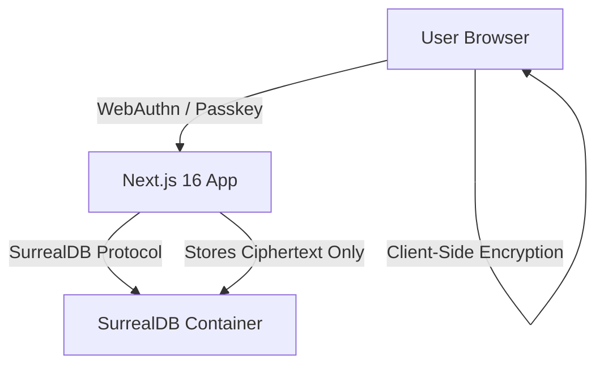
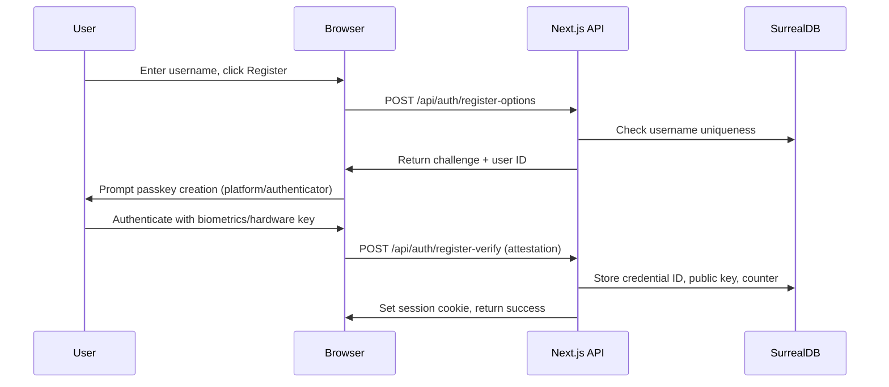
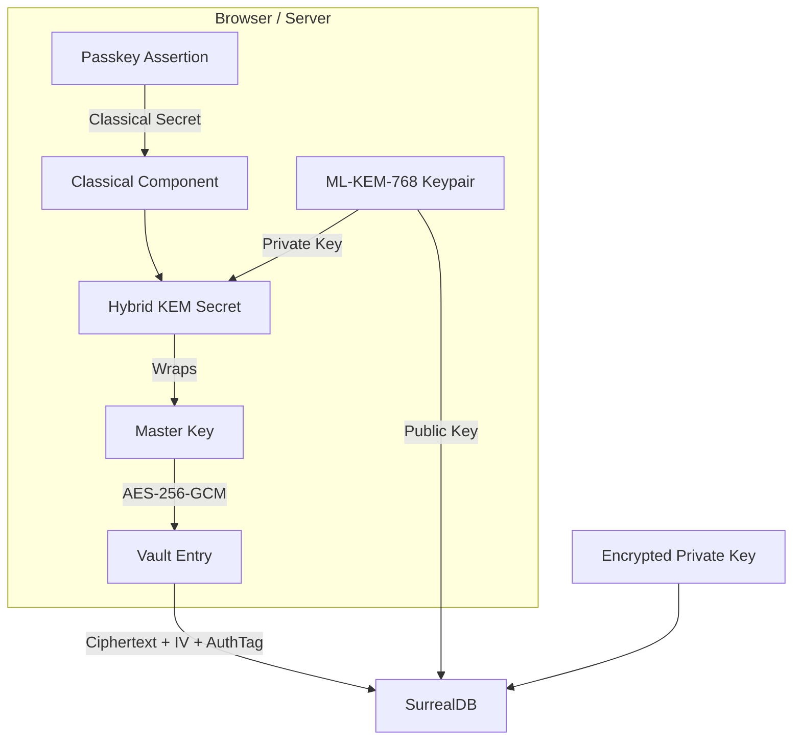

# QVault: End-to-End Implementation Plan

## Executive Summary

QVault is a zero-knowledge password manager built with Next.js 16 and SurrealDB. It uses passkey-only authentication (WebAuthn/FIDO2) and client-side AES-256-GCM encryption to ensure the server never has access to plaintext passwords or decryption keys.

## Architecture Overview



### Zero-Knowledge Flow
1. User authenticates with passkey (no password)
2. Client derives or retrieves a master encryption key
3. All vault data is encrypted/decrypted exclusively in the browser
4. SurrealDB stores only opaque ciphertext, IVs, and metadata

---

## Phase 1: Project Setup & Infrastructure

**Status: ✅ Complete**

**Goal:** Initialize the Next.js 16 project, configure tooling, and set up local SurrealDB via Docker.

### Completed Tasks
- [x] Initialize Next.js 16 with App Router, TypeScript, and Tailwind CSS v4
- [x] Configure ESLint (`eslint.config.mjs`, `eslint-config-next`)
- [x] Set up Docker Compose with SurrealDB service (`docker-compose.yml`, `docker-compose.prod.yml`)
- [x] Configure SurrealDB with root credentials and initial namespace/database
- [x] Install core dependencies: `surrealdb`, `@simplewebauthn/browser`, `@simplewebauthn/server`, `zod`, `jose`, `mlkem`, `sha3`, `@noble/curves`
- [x] Create environment variable schema (`src/lib/env.ts`) for DB connection and WebAuthn RP config
- [x] Verify connectivity between Next.js app and SurrealDB container via health check endpoint
- [x] Add `package.json` scripts: `dev`, `build`, `db:up`, `db:down`, `db:migrate`, `db:rollback`, `typecheck`

### Key Decisions
- **App Router:** Required for Server Actions and API route colocation.
- **SurrealDB Protocol:** Use the official JS SDK with WebSocket connection for real-time capabilities.
- **Tailwind CSS v4:** Used with PostCSS plugin (`@tailwindcss/postcss`).

---

## Phase 2: Database Design & Schema

**Status: ✅ Complete**

**Goal:** Design and implement SurrealDB tables, relations, and access controls.

### Schema Design (Implemented in Migrations)

```sql
-- Namespace and Database
USE NS qvault DB qvault;

-- User table: stores passkey credentials and public key metadata
DEFINE TABLE user SCHEMAFULL;
DEFINE FIELD username ON user TYPE string ASSERT $value != NONE;
DEFINE FIELD credential_id ON user TYPE string;
DEFINE FIELD public_key ON user TYPE string;
DEFINE FIELD counter ON user TYPE int DEFAULT 0;
DEFINE FIELD created_at ON user TYPE datetime DEFAULT time::now();
DEFINE INDEX idx_username ON user COLUMNS username UNIQUE;

-- Vault Entry table: stores encrypted password records
DEFINE TABLE vault_entry SCHEMAFULL;
DEFINE FIELD user_id ON vault_entry TYPE record<user> ASSERT $value != NONE;
DEFINE FIELD encrypted_data ON vault_entry TYPE string ASSERT $value != NONE;
DEFINE FIELD iv ON vault_entry TYPE string ASSERT $value != NONE;
DEFINE FIELD auth_tag ON vault_entry TYPE string ASSERT $value != NONE;
DEFINE FIELD title ON vault_entry TYPE string;
DEFINE FIELD group_id ON vault_entry TYPE option<record<vault_group>>;
DEFINE FIELD created_at ON vault_entry TYPE datetime DEFAULT time::now();
DEFINE FIELD updated_at ON vault_entry TYPE datetime DEFAULT time::now();
DEFINE INDEX idx_user_id ON vault_entry COLUMNS user_id;

-- Session table: manages active authenticated sessions
DEFINE TABLE session SCHEMAFULL;
DEFINE FIELD user_id ON session TYPE record<user> ASSERT $value != NONE;
DEFINE FIELD expires_at ON session TYPE datetime ASSERT $value != NONE;
DEFINE INDEX idx_session_expiry ON session COLUMNS expires_at;

-- Audit log table
DEFINE TABLE audit_log SCHEMAFULL;
DEFINE FIELD user_id ON audit_log TYPE record<user>;
DEFINE FIELD action ON audit_log TYPE string ASSERT $value != NONE;
DEFINE FIELD resource ON audit_log TYPE string;
DEFINE FIELD details ON audit_log TYPE object;
DEFINE FIELD created_at ON audit_log TYPE datetime DEFAULT time::now();
DEFINE INDEX idx_audit_user ON audit_log COLUMNS user_id;
DEFINE INDEX idx_audit_created ON audit_log COLUMNS created_at;

-- Challenge table (for WebAuthn challenge storage)
DEFINE TABLE challenge SCHEMAFULL;
DEFINE FIELD key ON challenge TYPE string ASSERT $value != NONE;
DEFINE FIELD challenge ON challenge TYPE string ASSERT $value != NONE;
DEFINE FIELD expires_at ON challenge TYPE int ASSERT $value != NONE;
DEFINE INDEX idx_challenge_key ON challenge COLUMNS key UNIQUE;
DEFINE INDEX idx_challenge_expiry ON challenge COLUMNS expires_at;

-- Vault Group table
DEFINE TABLE vault_group SCHEMAFULL;
DEFINE FIELD user_id ON vault_group TYPE record<user>;
DEFINE FIELD name ON vault_group TYPE string ASSERT $value != NONE;
DEFINE FIELD color ON vault_group TYPE option<string>;
DEFINE FIELD created_at ON vault_group TYPE option<datetime> DEFAULT time::now();
```

### Completed Tasks
- [x] Migration files created (`migrations/0001_initial_schema.ts`, `0002_add_challenge_table.ts`, `0003_add_pq_fields.ts`, `0004_add_vault_groups.ts`)
- [x] Build a schema migration/initialization script (`migrations/runner.ts`) with up/down support and `_migration` tracking table
- [x] Implement a typed SurrealDB connection wrapper (`src/lib/db.ts`) with circuit breaker, retry logic, and health checks
- [x] Define Zod schemas for all database entities (`src/lib/zod.ts`)
- [x] Seed script capability via migration runner

---

## Phase 3: Passkey Authentication (WebAuthn)

**Status: ✅ Complete**

**Goal:** Implement username + passkey registration and login with no traditional passwords.

### Authentication Flow



### Completed Tasks
- [x] Configure WebAuthn Relying Party (RP) settings in `src/lib/env.ts` (origin, RP ID, RP name)
- [x] Implement `POST /api/auth/register-options` endpoint
- [x] Implement `POST /api/auth/register-verify` endpoint
- [x] Implement `POST /api/auth/login-options` endpoint
- [x] Implement `POST /api/auth/login-verify` endpoint
- [x] Implement `POST /api/auth/logout` endpoint
- [x] Create session management with JWT tokens (`src/lib/session.ts`) — HTTP-only, Secure, SameSite cookies
- [x] Build React hook: `usePasskeyAuth` with retry logic and user-friendly error messages
- [x] Create UI components: `RegisterForm`, `LoginForm`, `AuthLayout`
- [x] Server Action `setSessionCookie` to bridge API authentication with cookie-based sessions
- [x] Counter verification via `updateUserCounter`

### Key Decisions
- **No Passwords:** Registration and login are strictly passkey-only.
- **Session Management:** Use HTTP-only, Secure, SameSite=Lax cookies via `jose` JWT library.
- **Counter Verification:** Prevent replay attacks by verifying authenticator counters.
- **Cookie Bridge:** Login verify returns `userId`; client calls Server Action `setSessionCookie` to bypass route handler cookie limitations.

---

## Phase 4: Vault Encryption Layer (Post-Quantum Hybrid)

**Status: ✅ Complete**

**Goal:** Build a zero-knowledge, post-quantum resistant encryption system using a hybrid approach that combines NIST-standardized post-quantum algorithms with classical cryptography.

### Why Post-Quantum?

While `AES-256-GCM` is already resistant to Grover's algorithm (quantum search only reduces the effective security from 256-bit to 128-bit, which remains secure), the **key encapsulation** mechanism protecting the master key is vulnerable to future quantum computers running Shor's algorithm. This phase implements a **Hybrid Post-Quantum Key Encapsulation Mechanism (HPQ-KEM)** to protect the master key.

### Encryption Architecture



### Key Derivation & Storage
1. **Master Key Generation**: During registration, generate a random 256-bit `master_key` using `crypto.getRandomValues`.
2. **Post-Quantum Keypair**: Generate a `ML-KEM-768` keypair using the `mlkem` library.
3. **Classical Secret**: Generate a random 256-bit classical secret for hybrid encapsulation.
4. **Hybrid KEM**: Perform hybrid encapsulation:
   - Encapsulate a shared secret against the `ML-KEM-768` public key.
   - Combine the ML-KEM shared secret with the classical secret using `HKDF-SHA-256`.
   - Use this hybrid secret to wrap (encrypt) the `master_key`.
5. **Storage**: Store the `ML-KEM-768` public key, the encrypted master key (ciphertext), and the encrypted ML-KEM private key (wrapped by the server secret via AES-256-GCM) in SurrealDB.
6. **Vault Entries**: For each entry, generate a random 96-bit IV and encrypt with `AES-256-GCM` using the `master_key`.

### Completed Tasks
- [x] Install post-quantum dependencies: `mlkem` (Module-Lattice-based KEM), `sha3` (for HKDF)
- [x] Implement client-side `src/lib/pqcrypto.ts`:
  - `generateMLKEMKeypair()`
  - `hybridEncapsulate(publicKey, classicalSecret)`
  - `hybridDecapsulate(ciphertext, privateKey, classicalSecret)`
  - `wrapMasterKey(masterKey, sharedSecret)`
  - `unwrapMasterKey(wrappedKey, salt, sharedSecret)`
  - `hkdfSha256(ikm, salt, length)`
- [x] Implement server-side `src/lib/vault-crypto.ts` (superset of client crypto + server secret encryption):
  - `generateMasterKey()`
  - `generateClassicalSecret()`
  - `encryptWithServerSecret(plaintext)` / `decryptWithServerSecret(ciphertext, iv, authTag)`
  - `encryptEntry(plaintext, masterKey)` / `decryptEntry(ciphertext, iv, authTag, masterKey)`
- [x] Implement secure key storage strategy:
  - Store encrypted master key and encrypted ML-KEM private key in SurrealDB for cross-device sync.
  - Cache unwrapped `master_key` in JWT session cookie (encrypted at rest, available server-side for decryption).
  - Legacy user migration: on first login, generate PQ keys on-the-fly and store them.
- [x] Add key recovery for legacy users: automatic PQ key generation for accounts created before PQC fields existed

### Security Requirements
- **Hybrid Approach**: Always combines ML-KEM with a classical random secret. Ensures security even if a vulnerability is found in ML-KEM.
- **Symmetric Cipher**: Use `AES-256-GCM` for vault entries. Post-quantum secure for data at rest.
- **Key Derivation**: Use `HKDF-SHA-256` for all key derivation steps.
- **Server Secret**: ML-KEM private keys are encrypted at rest with a server-side secret (`SERVER_SECRET`) before storage.

---

## Phase 5: Core Vault API

**Status: ✅ Complete**

**Goal:** Develop CRUD endpoints for encrypted password entries.

### API Design

| Method | Endpoint | Description |
|--------|----------|-------------|
| GET | `/api/vault` | List all encrypted entries for the authenticated user (optionally filtered by `?group=`). Server-side decrypts if master key available. |
| POST | `/api/vault` | Create a new encrypted entry |
| GET | `/api/vault/[id]` | Retrieve a specific encrypted entry (with server-side decryption) |
| PUT | `/api/vault/[id]` | Update an existing encrypted entry |
| DELETE | `/api/vault/[id]` | Delete an entry |
| GET | `/api/vault/groups` | List vault groups |
| POST | `/api/vault/groups` | Create a vault group |
| GET | `/api/vault/groups/[id]` | Get a specific group |
| PUT | `/api/vault/groups/[id]` | Update a group |
| DELETE | `/api/vault/groups/[id]` | Delete a group (unlinks entries) |

### Completed Tasks
- [x] Implement `GET /api/vault` with user-scoped queries and optional group filter
- [x] Implement `POST /api/vault` to accept plaintext, encrypt server-side, and store encrypted blobs
- [x] Implement `GET /api/vault/[id]` with ownership verification and decryption
- [x] Implement `PUT /api/vault/[id]` for encrypted updates
- [x] Implement `DELETE /api/vault/[id]` with ownership verification
- [x] Implement vault groups API (full CRUD)
- [x] Add input validation using Zod schemas
- [x] Add structured audit logging via `logger` on all vault endpoints
- [x] Implement `src/lib/vault.ts` data access layer with ownership checks

### Pending Tasks
- [ ] Implement rate limiting on all vault endpoints (e.g., 100 req/min)
- [ ] Create `audit_log` table entries automatically on sensitive actions (table exists but not actively written to)

---

## Phase 6: UI/UX Implementation

**Status: ✅ Mostly Complete**

**Goal:** Build a responsive, intuitive dashboard for managing the password vault.

### Page Structure

```mermaid
graph TD
    A[/login] --> B[/register]
    A --> C[/dashboard]
    C --> D[/vault]
    C --> E[/generator]
    C --> F[/settings]
    D --> G[/vault/new]
    D --> H[/vault/[id]]
```

### Completed Tasks
- [x] Create global layout with navigation, auth state, and custom fonts (Inter + JetBrains Mono)
- [x] Build `/register` page with username input and passkey enrollment
- [x] Build `/login` page with username input and passkey assertion
- [x] Build `/dashboard` overview page (navigation cards to Vault, Generator, Settings)
- [x] Build `/vault` page with:
  - Group sidebar with color-coded groups, create/delete group functionality
  - Searchable/filterable list of entries by group
  - Copy-to-clipboard for username/password (on detail page)
  - Delete entries with confirmation
- [x] Build `/vault/new` form with title, username, password, email, phone, URL, notes, and group selection
- [x] Build `/vault/[id]` detail page with:
  - Show/hide password toggle
  - Copy-to-clipboard for all fields
  - Group editing
  - Entry deletion
- [x] Build `/generator` page with customizable password generator (length 8-64, uppercase, numbers, symbols)
- [x] Build `/settings` page for:
  - Session termination (logout)
  - Account deletion with passkey confirmation
  - Security info display (encryption, auth, architecture status)
- [x] Implement loading states
- [x] Build `PageHeader`, `AuthLayout`, `LoginForm`, `RegisterForm` components
- [x] Implement cyberpunk/dark aesthetic with glass cards, neon accents, and animated backgrounds

### Pending Tasks
- [ ] Implement error boundaries
- [ ] Add toast notifications
- [ ] Ensure full keyboard navigation and screen reader accessibility audit
- [ ] Add search functionality within vault list

---

## Phase 7: Security Hardening

**Status: ⚠️ Partial**

**Goal:** Implement defense-in-depth security measures.

### Completed Tasks
- [x] Configure security headers in `next.config.ts`:
  - `X-Frame-Options: DENY`
  - `X-Content-Type-Options: nosniff`
  - `Referrer-Policy: strict-origin-when-cross-origin`
- [x] Add security headers to all API responses via `api-wrapper.ts`
- [x] Implement structured request logging with request IDs
- [x] Sanitize error responses in production (via `api-wrapper.ts`)
- [x] Account deletion requires fresh passkey re-authentication (`/api/auth/delete-account/options` + `/verify`)
- [x] Conducted basic dependency audit — all core crypto dependencies (`mlkem`, `@simplewebauthn`, `jose`) are up to date

### Pending Tasks
- [ ] Configure strict Content Security Policy (CSP) headers in `next.config.js`
- [ ] Enable `Strict-Transport-Security` (HSTS) headers
- [ ] Implement API rate limiting using `rate-limiter-flexible` or Upstash Redis
- [ ] Add CSRF protection for all state-changing requests
- [ ] Write `audit_log` entries automatically on all sensitive actions
- [ ] Implement automatic session timeout and idle detection
- [ ] Add client-side inactivity lock (lock vault after X minutes of inactivity)
- [ ] Integrate Snyk or Dependabot for ongoing dependency monitoring
- [ ] Write a security runbook and penetration testing checklist

---

## Phase 8: Deployment & DevOps

**Status: ⚠️ Mostly Complete**

**Goal:** Containerize the application and set up a reproducible deployment pipeline.

### Completed Tasks
- [x] Create production `Dockerfile` for Next.js (multi-stage build with `output: standalone`)
- [x] Create `docker-compose.yml` with:
  - Next.js app service
  - SurrealDB service with volume persistence
- [x] Create `docker-compose.prod.yml` for production orchestration
- [x] Create `package.json` scripts for common tasks (`dev`, `db:up`, `db:down`, `db:migrate`, `db:rollback`, `typecheck`)
- [x] Write `README.md` with project overview
- [x] Add `src/proxy.ts` for proxy configuration

### Pending Tasks
- [ ] Add Nginx reverse proxy service for SSL termination in Docker Compose
- [ ] Create `.env.production` template with all required variables
- [ ] Set up GitHub Actions CI/CD pipeline:
  - Lint and type check on PR
  - Build and push Docker image on merge to main
  - Automated deployment to staging
- [ ] Create `Makefile` for common tasks
- [ ] Document production deployment steps in README

---

## Additional Features Implemented (Not in Original Plan)

- [x] **Account Deletion with Passkey Confirmation**: Users must re-authenticate with their passkey before account deletion. Endpoints: `POST /api/auth/delete-account/options` and `POST /api/auth/delete-account/verify`.
- [x] **Health Check Endpoint**: `GET /api/health` returns database connectivity status and latency.
- [x] **Circuit Breaker Pattern**: Database connection wrapper includes circuit breaker to fail fast during DB outages.
- [x] **Retry Logic**: `usePasskeyAuth` hook and `fetchWithRetry` utility handle transient network failures with exponential backoff.
- [x] **Legacy User Migration**: Users created before post-quantum fields automatically get PQ keys generated on their next login.
- [x] **Server-Side Decryption**: Vault entries are decrypted server-side when the master key is available in the session, providing seamless UX without exposing keys to the client.

---

## Technology Stack Summary

| Layer | Technology |
|-------|------------|
| Framework | Next.js 16.2.6 (App Router) |
| Language | TypeScript 5.x |
| Styling | Tailwind CSS v4 |
| Database | SurrealDB 2.x (self-hosted) |
| Auth | WebAuthn / FIDO2 (`@simplewebauthn` v13.3) |
| Post-Quantum KEM | ML-KEM-768 (NIST FIPS 203) via `mlkem` v2.7 |
| Classical Hybrid | Random classical secret + HKDF-SHA-256 |
| Symmetric Cipher | AES-256-GCM (Web Crypto API) |
| Key Derivation | HKDF-SHA-256 |
| Session | JWT via `jose` v6.2 (HS256, HTTP-only cookies) |
| Validation | Zod v4.4 |
| Container | Docker & Docker Compose |
| CI/CD | GitHub Actions (planned) |

## Risk & Mitigation

| Risk | Mitigation |
|------|------------|
| Master key loss (no password fallback) | Implement encrypted backup export/import flow |
| Passkey platform lock-in | Support multiple passkeys per account (future) |
| XSS stealing master key from memory | Minimize key lifetime in JS; server-side decryption keeps keys out of browser |
| SurrealDB data breach | Zero-knowledge + PQC ensures stolen data is unreadable even by quantum adversaries |
| Browser extension autofill scope | Defer to Phase 2 (future mobile/browser extension) |
| ML-KEM implementation bugs | Use well-audited libraries (`mlkem`) and hybrid fallback with classical secret |
| Quantum computer timeline uncertainty | Hybrid approach ensures classical security today, quantum security tomorrow |
